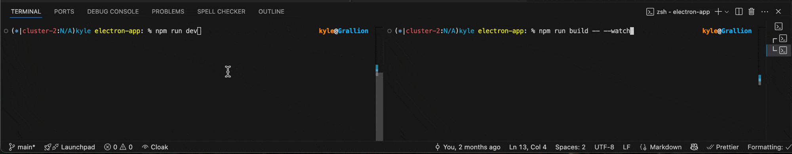

# Portfolio Maintainer 

This is being managed with [backlog.md](https://github.com/MrLesk/Backlog.md?&aid=rec0STTpsH2WsVaY0)

`npm run backlog`

This project does not yet have HMR. So for best results open two terminal. 

The first runs the app: 
```
npm run dev
```

The second runs the typescript build in watch mode
```
npm run build -- --watch
```



# Since there is NO HMR use Cmd + R to reload the electron app after each change.